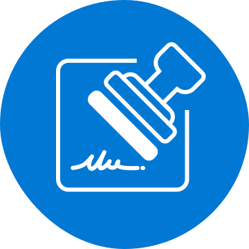
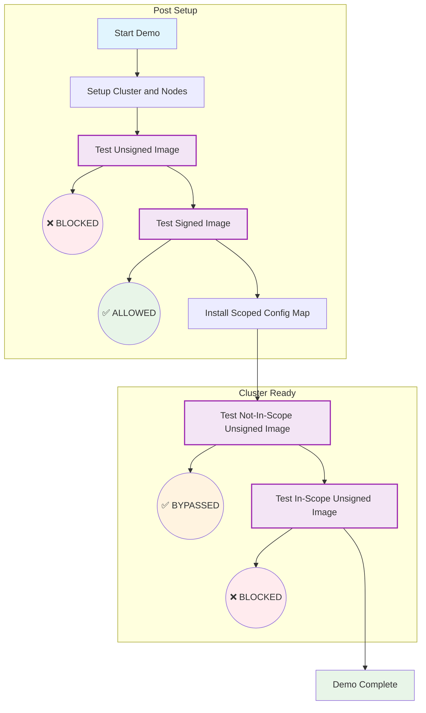

<div align="center">

</div>

# Ratify Containerd Prototype

> [!CAUTION]
> This repository is marked EXPERIMENTAL. It demonstrates only a Proof of Concept. Contents may be altered at any time.

## Getting Started

Please refer to exploration [document](docs/overview.md) for more details.

### Prerequisites

* kubectl
* minikube

### Walkthrough

As part of the demo, we will walk through the following steps:



#### Setup the Cluster and Nodes

1. Create a `minikube` cluster with containerd container runtime

    ```bash
    minikube start -n 2 --container-runtime containerd
    ```

1. Setup monitor daemon

    ```bash
    kubectl apply -f https://raw.githubusercontent.com/qweeah/ratify-containerd/refs/heads/demo/k8s-templates/config-monitor/config-monitor-role.yaml
    kubectl apply -f https://raw.githubusercontent.com/qweeah/ratify-containerd/refs/heads/demo/k8s-templates/config-monitor/config-monitor-rolebinding.yaml
    kubectl apply -f https://raw.githubusercontent.com/qweeah/ratify-containerd/refs/heads/demo/k8s-templates/config-monitor/config-monitor-serviceaccount.yaml
    kubectl apply -f https://raw.githubusercontent.com/qweeah/ratify-containerd/refs/heads/demo/k8s-templates/config-monitor/config-monitor.yaml
    ```

1. Setup node with required binaries. Wait for 30-40 seconds for daemonset to complete (Note: daemonset pods will not terminate. check logs for completion)

    ```bash
    kubectl apply -f https://raw.githubusercontent.com/qweeah/ratify-containerd/refs/heads/demo/k8s-templates/node/clusterrolebinding.yaml
    kubectl apply -f https://raw.githubusercontent.com/qweeah/ratify-containerd/refs/heads/demo/k8s-templates/node/configure-nodes.yaml
    ```

#### Post Setup

1. Unsigned image cannot be installed

    ```bash
    kubectl run demo-unsigned --image=ghcr.io/ratify-project/ratify/notary-image:unsigned
    kubectl describe pod demo-unsigned
    ```

1. Signed image can be installed

    ```bash
    kubectl run demo-signed --image=ghcr.io/ratify-project/ratify/notary-image:signed
    kubectl describe pod demo-signed
    ```

1. Install scoped config map

    ```bash
    kubectl apply -f https://raw.githubusercontent.com/qweeah/ratify-containerd/refs/heads/demo/k8s-templates/scoped-config/scoped-config.yaml
    kubectl get configmap scoped-config-azurearck8s-metrics-agent -o jsonpath="{.data}"
    ```

#### Cluster ready

1. Unsigned image verification should be by-passed (wait for 10-20 seconds for monitor to pick up the config map)

    ```bash
    kubectl run demo-bypassed --image=ghcr.io/ratify-project/ratify/notary-image:unsigned
    kubectl describe pod demo-bypassed
    ```

1. In-scope image verification will be enforced

    ```bash
    kubectl run demo-unsigned --image=ghcr.io/qweeah/ratify/notary-image:unsigned
    kubectl describe pod demo-unsigned
    ```

## Code of Conduct

ratify-containerd follows the [CNCF Code of Conduct](https://github.com/cncf/foundation/blob/master/code-of-conduct.md).

## Licensing

This project is released under the [Apache-2.0 License](./LICENSE).

## Trademark

This project may contain trademarks or logos for projects, products, or services. Authorized use of Microsoft trademarks or logos is subject to and must follow [Microsoft's Trademark & Brand Guidelines][microsoft-trademark]. Use of Microsoft trademarks or logos in modified versions of this project must not cause confusion or imply Microsoft sponsorship. Any use of third-party trademarks or logos are subject to those third-party's policies.

[microsoft-trademark]: https://www.microsoft.com/legal/intellectualproperty/trademarks
